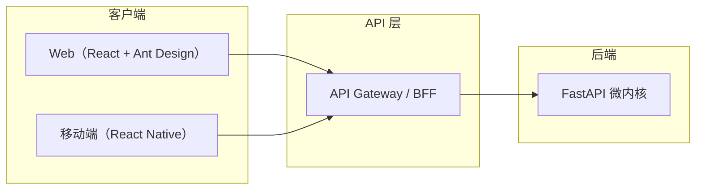
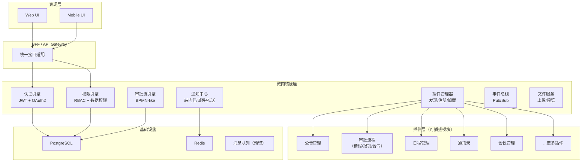
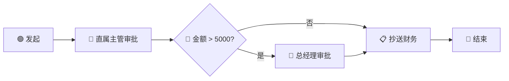
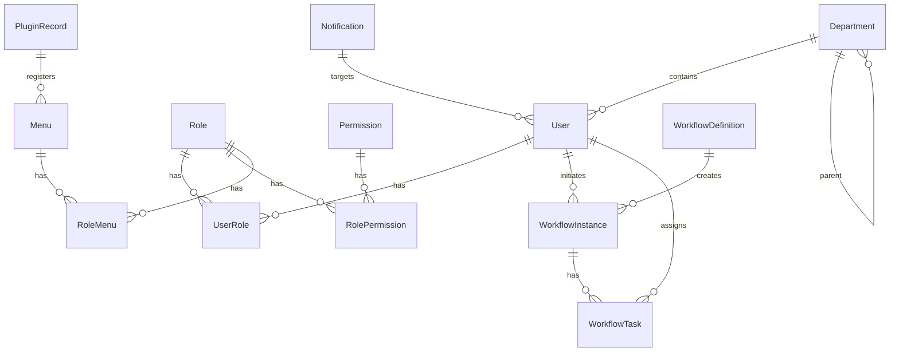
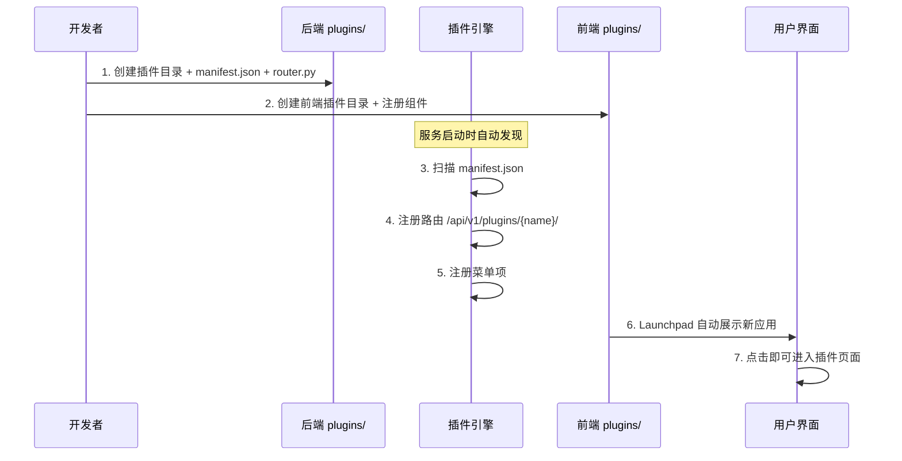

# OA 协同办公系统 — 产品设计文档

> **版本** v1.0 | **日期** 2026-02-21

---

## 1. 产品概述

### 1.1 产品定位
基于**微内核架构**（底座 + 可插拔子模块）的企业级协同办公平台。底座提供用户认证、权限管理、审批流引擎、通知中心等核心能力；业务功能以插件形式动态挂载，支持热插拔和独立升级。

### 1.2 目标用户
中大型企业、政府及事业单位的内部办公场景。

### 1.3 核心价值
| 价值主张 | 说明 |
|---------|------|
| **可插拔扩展** | 新模块仅需遵循插件协议即可接入，无需修改底座代码 |
| **多端统一** | 一套后端 API + 共享业务逻辑，Web / Android / iOS 三端可用 |
| **可视化审批** | 用户可拖拽设计审批流程图，支持条件分支、会签、委托、子流程 |
| **渐进式构建** | 底座先行，业务模块按需集成 |

---

## 2. 多端策略



| 端 | 技术栈 | 说明 |
|----|--------|------|
| **Web** | React 18 + TypeScript + Vite + Ant Design 5 + Zustand | OS 风格桌面布局，完整功能 |
| **Android / iOS** | React Native + TypeScript + Zustand + React Native Paper | 共享 stores / services / types 层，UI 层各端独立 |
| **共享层** | `packages/shared/` | Zustand stores, API services, TypeScript types, 工具函数 |

### 2.1 代码复用架构

```
OA/
├── packages/
│   └── shared/           # 跨端共享代码（monorepo）
│       ├── types/         # TypeScript 类型定义
│       ├── stores/        # Zustand 状态管理
│       ├── services/      # API 调用层
│       └── utils/         # 工具函数
├── frontend/              # Web 端
├── mobile/                # React Native 移动端
└── backend/               # FastAPI 后端
```

> **注意**：当前阶段**先实现 Web 端**，Mobile 端后续接入。共享层从 Web 端抽离，确保代码可复用。

---

## 3. 系统架构

### 3.1 微内核架构分层



### 3.2 插件协议

每个插件是一个独立目录，遵循以下规范：

```
plugins/
└── my-plugin/
    ├── manifest.json      # 插件元数据（必须）
    ├── router.py          # API 路由（必须）
    ├── models.py          # ORM 模型（可选）
    ├── schemas.py         # Pydantic 模型（可选）
    ├── services.py        # 业务逻辑（可选）
    └── events.py          # 事件监听器（可选）
```

**manifest.json 规范：**

```json
{
  "name": "my-plugin",
  "version": "1.0.0",
  "displayName": "我的插件",
  "description": "插件说明",
  "icon": "AppstoreOutlined",
  "author": "developer",
  "dependencies": [],
  "menus": [
    {
      "name": "功能页面",
      "path": "/my-plugin/list",
      "icon": "UnorderedListOutlined"
    }
  ],
  "permissions": [
    "my-plugin:read",
    "my-plugin:write"
  ]
}
```

---

## 4. 功能模块设计

### 4.1 底座核心模块

#### 4.1.1 用户认证 & RBAC

| 功能 | 说明 |
|------|------|
| JWT 认证 | Access Token (15min) + Refresh Token (7d) |
| 用户管理 | CRUD、批量导入、头像、状态启停 |
| 角色管理 | 角色绑定权限 + 菜单，支持数据范围（全部/本部门/本人） |
| 权限管理 | 资源 + 操作粒度（如 `user:create`, `announcement:delete`） |
| 菜单管理 | 无限级树形菜单，插件自动注册菜单 |
| 部门/组织架构 | 树形部门结构，关联用户 |

#### 4.1.2 审批流引擎（仿致远 OA）

> 此为系统核心能力，前端提供可视化拖拽设计器，后端提供通用审批流运行时。

**节点类型：**

| 节点 | 图标 | 说明 |
|------|------|------|
| **发起节点** | 🟢 | 流程起点，配置发起人范围、表单字段 |
| **审批节点** | 🔵 | 指定审批人（按人/角色/部门主管/发起人上级），支持多人审批模式（或签/会签） |
| **抄送节点** | 📋 | 抄送通知指定人员（不阻塞流程） |
| **条件分支** | 🔶 | 根据表单字段值走不同分支（如金额 > 5000 走总经理审批） |
| **并行分支** | ⏸ | 多条分支并行执行，全部完成后汇聚 |
| **子流程** | 📦 | 嵌套调用另一个已定义的流程 |
| **结束节点** | 🔴 | 流程终点 |

**审批操作：**
- ✅ 同意 — 流转到下一节点
- ❌ 拒绝 — 流程结束 / 退回发起人 / 退回上一节点
- 🔄 转交 — 转给指定人审批
- ➕ 加签 — 审批前/后增加审批人
- ⏸ 挂起 — 暂停流程

**流程设计器前端（可视化拖拽）：**



- 基于 Canvas / SVG 的流程图编辑器（使用 `@antv/x6`）
- 拖拽添加节点 → 连线 → 配置每个节点的属性面板
- 实时预览流程走向
- 保存为 JSON 流程定义

**后端流程运行时：**
- 流程定义存储为 JSON（节点列表 + 连线关系 + 条件表达式）
- 流程实例表追踪每一次发起
- 任务表记录每个审批节点的状态（pending / approved / rejected）
- 条件表达式求值引擎（基于 Python `ast` 安全求值）

#### 4.1.3 通知中心

| 渠道 | 实现 |
|------|------|
| 站内信 | WebSocket 实时推送 + 数据库持久化 |
| 邮件 | SMTP / 邮件服务 API |
| App 推送 | FCM (Android) + APNs (iOS)，预留接口 |
| 企业微信/钉钉 | Webhook 预留接口 |

#### 4.1.4 文件服务
- 上传：分片上传 + 秒传（基于文件 hash）
- 存储：本地 / S3 / MinIO 可配置
- 预览：图片直出、Office 文件转 PDF 预览

---

### 4.2 内置业务插件

#### 公告管理（示例插件）
| 功能 | 说明 |
|------|------|
| 发布公告 | 标题、正文（富文本）、附件、发布范围 |
| 公告列表 | 分页、搜索、置顶、状态筛选 |
| 公告详情 | 阅读追踪、已读/未读统计 |

#### 审批流程模板（预置）
- 请假申请、报销申请、合同审批、用章申请
- 每个模板对应一个流程定义 + 表单模板

---

## 5. 数据模型

### 5.1 ER 关系概览



### 5.2 核心表结构

| 表名 | 关键字段 | 说明 |
|------|---------|------|
| `users` | id, username, email, phone, hashed_password, department_id, avatar, is_active | 用户 |
| `departments` | id, name, parent_id, sort_order, leader_id | 部门/组织 |
| `roles` | id, name, code, data_scope | 角色 |
| `permissions` | id, name, code, resource, action | 权限 |
| `menus` | id, name, path, icon, parent_id, sort_order, plugin_id, permission_code | 菜单 |
| `workflow_definitions` | id, name, form_schema(JSON), flow_schema(JSON), version, status | 流程定义 |
| `workflow_instances` | id, definition_id, initiator_id, form_data(JSON), status, current_node_id | 流程实例 |
| `workflow_tasks` | id, instance_id, node_id, assignee_id, action, comment, status | 审批任务 |
| `plugin_records` | id, name, version, enabled, config(JSON) | 插件注册 |
| `notifications` | id, user_id, title, content, type, is_read, link | 通知 |

---

## 6. API 设计规范

### 6.1 RESTful 规范

```
基础路径：/api/v1/

认证：   POST   /api/v1/auth/login
         POST   /api/v1/auth/register
         GET    /api/v1/auth/me
         POST   /api/v1/auth/refresh

用户：   GET    /api/v1/users
         POST   /api/v1/users
         PUT    /api/v1/users/{id}
         DELETE /api/v1/users/{id}

菜单：   GET    /api/v1/menus/tree
审批流：  GET    /api/v1/workflows/definitions
         POST   /api/v1/workflows/definitions
         POST   /api/v1/workflows/instances         # 发起流程
         POST   /api/v1/workflows/tasks/{id}/approve # 审批
         POST   /api/v1/workflows/tasks/{id}/reject
         POST   /api/v1/workflows/tasks/{id}/transfer

插件：   GET    /api/v1/plugins
         PUT    /api/v1/plugins/{name}/toggle

插件路由：/api/v1/plugins/{plugin-name}/...         # 插件自定义路由
```

### 6.2 通用响应格式

```json
{
  "code": 200,
  "message": "success",
  "data": {},
  "timestamp": "2026-02-21T22:30:00Z"
}
```

---

## 7. 前端设计

### 7.1 OS 风格桌面布局

```
┌──────────────────────────────────────────────────────┐
│  TopBar: [🔍 搜索] [🔔 通知] [👤 用户菜单]            │
├────┬─────────────────────────────────────────────────┤
│    │                                                 │
│ S  │            内容视图区                              │
│ i  │     （动态路由 + 过渡动画）                         │
│ d  │                                                 │
│ e  │    ┌─────────────────┐                          │
│ b  │    │  Dashboard /     │                          │
│ a  │    │  Module Pages /   │                          │
│ r  │    │  Plugin Views     │                          │
│    │    └─────────────────┘                          │
│    │                                                 │
│ 📊 │                                                 │
│ 📋 │                                                 │
│ 👥 │                                                 │
│ ⚙️ │                                                 │
│ 🚀 │ ← Launchpad 入口                                │
├────┴─────────────────────────────────────────────────┤
│  StatusBar (optional)                                │
└──────────────────────────────────────────────────────┘
```

**Launchpad 弹出层：**
- 全屏毛玻璃半透明背景
- 应用图标网格（聚合所有已启用插件 + 系统功能）
- 搜索过滤 + 分类标签
- 缩放 + 淡入淡出动画

### 7.2 审批流设计器

| 特性 | 实现方案 |
|------|---------|
| 画布引擎 | `@antv/x6`（AntV 流程图库） |
| 节点拖拽 | 左侧节点面板 → 拖入画布 |
| 属性配置 | 点击节点 → 右侧属性面板（审批人、条件表达式） |
| 连线规则 | 自动连接 + 手动调整 + 验证（防止成环） |
| 导出/导入 | JSON 格式保存到后端 |
| 条件编辑器 | 表单字段 + 操作符 + 值的可视化条件构建器 |

### 7.3 关键交互

| 交互 | 体验要求 |
|------|---------|
| 页面切换 | 路由过渡动画（Fade + Slide），骨架屏加载 |
| Launchpad | 打开/关闭带缩放动画，输入搜索即时过滤 |
| 审批流设计器 | 60fps 拖拽体验，实时连线吸附，undo/redo |
| 通知推送 | 右上角弹出 Toast + 铃铛角标实时更新 |
| 表格操作 | 行内编辑、批量操作、列筛选器 |

---

## 8. 可扩展性设计

### 8.1 新增插件流程



### 8.2 扩展点

| 扩展点 | 机制 |
|--------|------|
| 新增 API | 插件 `router.py` 自动挂载 |
| 新增页面 | 前端插件注册路由 + 菜单 |
| 新增审批流模板 | 流程设计器创建 + 保存 |
| 新增通知渠道 | 实现 `NotificationChannel` 协议 |
| 新增数据模型 | 插件 `models.py` + Alembic 迁移 |
| 事件监听 | 插件 `events.py` 注册事件处理器 |

---

## 9. 实施路线图

| 阶段 | 内容 | 状态 |
|------|------|------|
| **Phase 1** | 底座搭建：后端微内核 + 认证 + RBAC + Web 桌面布局 | 🔜 当前 |
| **Phase 2** | 审批流引擎 + 可视化设计器 | 待启动 |
| **Phase 3** | 通知中心 + 文件服务 | 待启动 |
| **Phase 4** | 共享层抽离 + React Native 移动端 | 待启动 |
| **Phase 5** | 更多业务插件（日程/会议/通讯录） | 待启动 |
